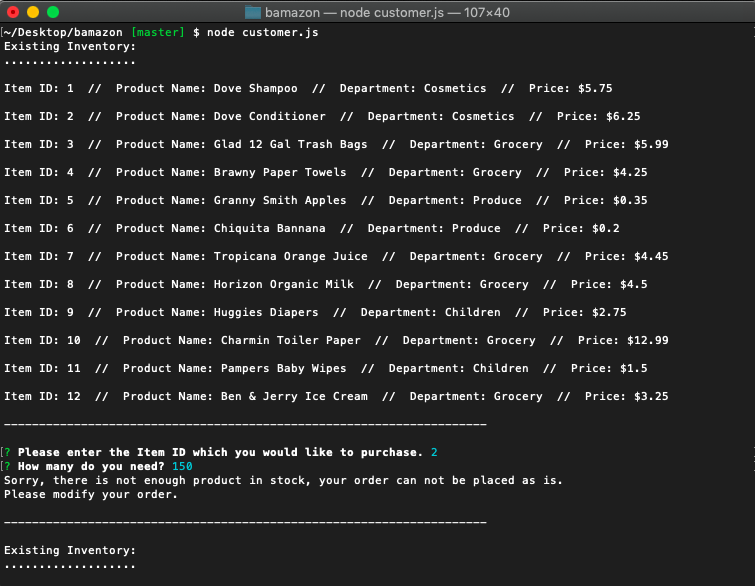
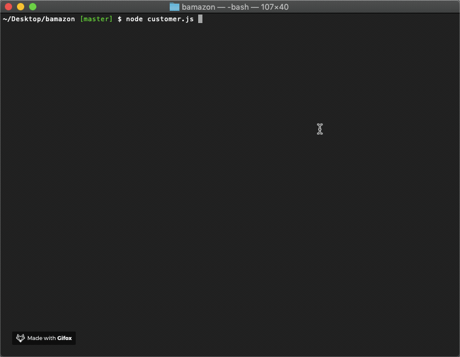

# bamazon





# Description
This application implements a simple command line based storefront using the npm inquirer package and the MySQL database backend together with the npm mysql package. 

# MySQL Database Setup
In order to run this application, you should have the MySQL database already set up on your machine. If you don't, visit the MySQL installation page to install the version you need for your operating system. Once you have MySQL isntalled, you will be able to create the Bamazon database and the products table with the SQL code found in Bamazon.sql. Run this code inside your MySQL client like Sequel Pro to populate the database, then you will be ready to proceed with running the Bamazon as a customer.

# Customer 
The app allows the user to view the current inventory of store items: item IDs, descriptions, department in which the item is located and price. The user is then able to purchase one of the existing items by entering the item ID and the desired quantity. If the selected quantity is currently in stock, the user's order is fulfilled, displaying the total purchase price and updating the store database. If the desired quantity is not available, the user is prompted to modify their order.

To run the app please follow the steps below:

```git clone git@github.com:angrbrd/bamazon.git
cd bamazon
npm install
node customer.js
```


## Built with :

* [Node](https://www.w3schools.com/nodejs/nodejs_intro.asp) 

* [Javascript](https://www.w3schools.com/js/js_intro.asp)

* [Mysql](https://www.mysql.com/)

<hr>

## Authors

* [Raghav Shiv](https://github.com/rshiv7)